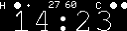
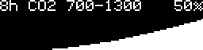
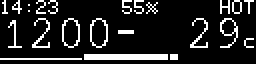
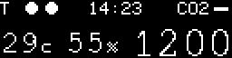

# pico_co2

Raspberry Pico CO2 measurements

This project is designed to show time, temperature, CO2 levels using a Raspberry Pi Pico microcontroller. It integrates sensors and displays to provide real-time data visualization.

## Hardware installation

### Required components

- Raspberry Pico board
- SSD1306 display
- AHT20+ENS160 sensor
- SCD4x sensor
- DS3231
- touch buttons (2x)

## Button Controls

Two capacitive touch buttons control display navigation and clock setup.

### Normal Mode

- Left button: previous display screen
- Right button: next display screen

### Clock Setup Mode

Clock setup allows setting the DS3231 real-time clock on-device using the two touch buttons.

**Entering clock setup**

1. Navigate to the time screen
2. Press both buttons within a ~400 ms window
3. The display switches to edit mode, showing the current hour in brackets

**Editing time**

- Left button: cycle through fields in order: hour -> minute -> save -> cancel
- Right button:
  - On hour field: increment hour (wraps 23 -> 0)
  - On minute field: increment minute (wraps 59 -> 0)
  - On save: write the new time to the RTC and exit edit mode
  - On cancel: discard changes and exit edit mode

**Display indicators in edit mode**

- `[14]:05` - hour selected (shown in brackets)
- `14:[05]` - minute selected
- `[SAVE] EXIT` - save selected
- `SAVE [EXIT]` - cancel selected

**Exiting without saving**

- Press both buttons again at any time to cancel and return to normal mode
- Navigate to the cancel field and press right

## Software installation

```bash
make flash
```

## Generate all possible display themes

```bash
make test-displays
```

This regenerates the active screens and `images/gallery/`, then lists image changes for visual review.

## Display Themes

Below are examples of the different display themes available:

### Main Display



### CO2 Graph Display



### Sleep Scale Display

CO2 and temperature at the same size, humidity and the thermal zone on the top strip. The bar
along the bottom edge is empty while the room is fine and grows past the comfort boundary once
it is not - see [docs/thermal-index.md](docs/thermal-index.md).



### Three Values With Trend



## Background research

Why the displayed numbers and thresholds are what they are, with sources:

- [docs/thermal-index.md](docs/thermal-index.md) - why the NWS heat index is unusable below
  27 °C, the Steadman apparent temperature used instead, and how the sleep thresholds map onto
  its scale.
- [docs/sleep-bedding.md](docs/sleep-bedding.md) - what "comfort up to 29 °C" requires in
  practice: bedding insulation in clo and tog, coverage, airflow, and how to run an air
  conditioned room whose doors have to stay shut.
- [docs/sleep-thresholds.md](docs/sleep-thresholds.md) - evidence-based operating points for
  CO₂, apparent temperature and relative humidity, including the distinction between early
  warning values and strong action values.

## Case


## Development

The module minimum is Go 1.24.2. Firmware and images were verified with Go 1.25.9 and TinyGo 0.39.0, as recorded in `.tool-versions`.

The program has three small boundaries:

- `cmd/pico_co2` owns Pico hardware setup and the main loop.
- `internal/app` owns state and one testable `Tick`.
- `pkg/font`, `pkg/widget`, and `pkg/layout` provide reusable drawing pieces; `internal/display` composes the active screens.

Display errors are intentionally ignored: there is no useful recovery path for
a failed OLED transfer, and the watchdog restarts the board if the loop stops.
The image baseline was regenerated after the rendering refactor because the
previous generator used different sample data and names; keep sample data and
rendering changes in separate commits.

The reference firmware measurement is `code 79010, rodata 25230, data 26952,
bss 5800, flash 131192, ram 32752`, built with Go 1.25.9 and TinyGo 0.39.0
for `pico`.
The RAM figure is static allocation, not maximum runtime consumption.

To add a screen, compose rows and widgets in `internal/display`, add a `display.Screen` to `ActiveScreens`, and run `make test-displays` to inspect the result.

Run host checks with:

```bash
make test-unit
make check-images
```

### requirements for vim development

- go version go1.25.9 linux/amd64
- tinygo version 0.39.0 linux/amd64
- go install github.com/sago35/tinygo-edit@latest
- run as `tinygo-edit --target pico --editor nvim --wait`
